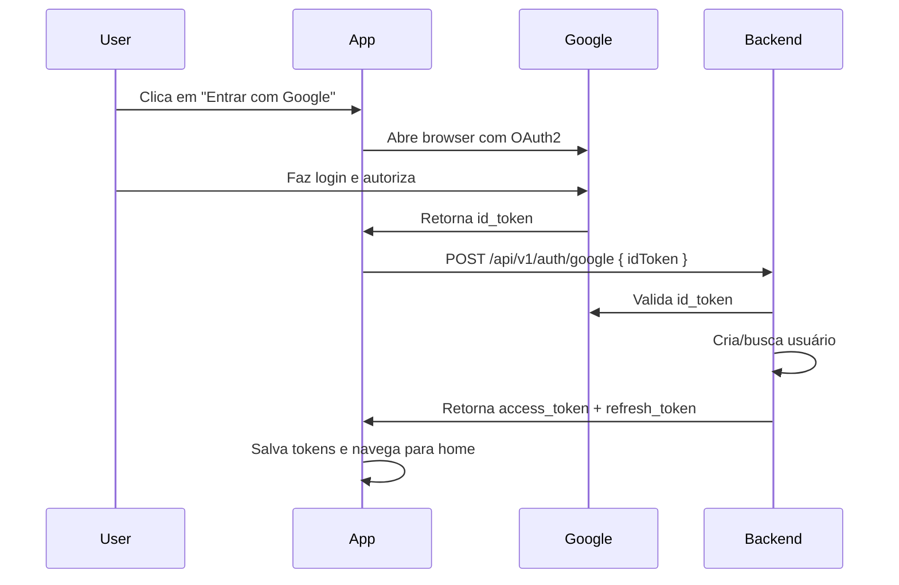

# 🔐 Google OAuth2 Login - Guia de Configuração

## 📋 Visão Geral

O frontend agora suporta autenticação via Google OAuth2 usando **Expo Auth Session**. O usuário pode fazer login com sua conta Google e o app recebe um `idToken` que é enviado para o backend.

---

## 🚀 Como Configurar

### **1️⃣ Obter Google Client ID**

1. Acesse: https://console.cloud.google.com/
2. Crie um projeto (ou selecione existente)
3. Vá para **APIs & Services** > **Credentials**
4. Clique em **Create Credentials** > **OAuth 2.0 Client ID**
5. Selecione tipo: **Web application**
6. Configure os **Authorized redirect URIs**:
   - Para desenvolvimento: `https://auth.expo.io/@YOUR_USERNAME/frontend`
   - Para produção: Configure conforme seu domínio

**Importante:** Para desenvolvimento com Expo Go, você precisa usar o redirect URI do Expo:
```
https://auth.expo.io/@YOUR_EXPO_USERNAME/YOUR_SLUG
```

Para descobrir seu redirect URI exato, execute:
```bash
npx expo start
# No console, procure por: "Expo Go Redirect URI"
```

### **2️⃣ Configurar o Frontend**

Edite o arquivo `.env` na raiz do projeto:

```bash
# Google OAuth2 Configuration
GOOGLE_CLIENT_ID=seu-client-id-aqui.apps.googleusercontent.com
```

### **3️⃣ Configurar o Backend**

Certifique-se de que o backend também tem o Google Client ID configurado para validar o token:

```bash
# No backend/.env
GOOGLE_CLIENT_ID=seu-client-id-aqui.apps.googleusercontent.com
```

### **4️⃣ Reiniciar a Aplicação**

```bash
# Frontend
npm start

# Backend (se necessário)
./mvnw spring-boot:run
```

---

## 🔄 Fluxo de Autenticação



---

## 🎯 Componentes Implementados

### **Domain Layer**
- ✅ `AuthRepository.loginWithGoogle(idToken)` - Contrato no domínio

### **Data Layer**
- ✅ `GoogleLoginRequestDto` - DTO para request
- ✅ `GoogleLoginResponseDto` - DTO para response
- ✅ `AuthDataSource.loginWithGoogle()` - Interface de data source
- ✅ `AuthApiDataSource.loginWithGoogle()` - Implementação chamando `/auth/google`
- ✅ `AuthRepositoryImpl.loginWithGoogle()` - Implementação do repositório

### **Infrastructure Layer**
- ✅ `GoogleAuthService` - Gerencia fluxo OAuth2 com Expo Auth Session
- ✅ `AuthService.loginWithGoogle()` - Orquestra login e storage
- ✅ `env.googleClientId` - Configuração centralizada

### **Presentation Layer**
- ✅ `AuthContext.signInWithGoogle()` - Hook para uso na UI
- ✅ `LoginScreen` - Botão "Entrar com Google" integrado

---

## 🧪 Como Testar

### **Desenvolvimento (Expo Go)**

1. Certifique-se de que o `GOOGLE_CLIENT_ID` está configurado
2. Inicie o app com `npm start`
3. Abra no dispositivo físico ou emulador
4. Clique em "Entrar com Google"
5. Autorize no navegador
6. Verifique se voltou para o app e fez login

### **Build de Produção**

Para builds standalone (EAS Build ou APK):

1. Configure o redirect URI correto no Google Console
2. Atualize o `scheme` no `app.config.js` se necessário
3. Faça build com `eas build` ou `expo build`

---

## ⚠️ Troubleshooting

### **Erro: "Error 400: invalid_request" ou "Authorization Error"**

**Causa:** O redirect URI usado pelo app não está autorizado no Google Console.

**Solução para Expo Go:**

1. Acesse: https://console.cloud.google.com/apis/credentials
2. Clique no seu OAuth Client ID
3. Em "Authorized redirect URIs", adicione:
   ```
   https://auth.expo.io/@anonymous/shopping-list
   shoppinglist://
   ```
4. **SAVE** e aguarde 2-3 minutos
5. Reinicie o app: `npm start --clear`

**Verificar redirect URI correto:**
Execute o app e veja o console, procure por:
```
🔗 Google OAuth Redirect URI: <URL AQUI>
```

### **Erro: "Redirect URI mismatch"**

**Causa:** O redirect URI configurado no Google Console não corresponde ao usado pelo app.

**Solução:**
1. Execute o app e veja no console qual redirect URI está sendo usado
2. Adicione esse URI exato no Google Console > Credentials > Authorized redirect URIs

### **Erro: "GOOGLE_CLIENT_ID não configurado"**

**Causa:** Variável de ambiente não está sendo carregada.

**Solução:**
1. Verifique se o `.env` existe e contém `GOOGLE_CLIENT_ID`
2. Reinicie o Metro bundler: `npm start --clear`
3. Verifique se o `app.config.js` está exportando a variável no `extra`

### **Erro: "Invalid ID Token"**

**Causa:** O backend não conseguiu validar o token do Google.

**Solução:**
1. Certifique-se de que o backend tem o mesmo `GOOGLE_CLIENT_ID` configurado
2. Verifique se o backend está usando a biblioteca correta de validação
3. Veja os logs do backend para mais detalhes

### **Navegador não abre**

**Causa:** Problema com o Expo Web Browser ou permissões.

**Solução:**
1. Verifique se `expo-web-browser` está instalado: `npm list expo-web-browser`
2. Em dispositivos físicos, permita que o app abra URLs externas
3. Use um emulador/simulador atualizado

---

## 📚 Referências

- [Expo Auth Session Documentation](https://docs.expo.dev/versions/latest/sdk/auth-session/)
- [Google OAuth2 Documentation](https://developers.google.com/identity/protocols/oauth2)
- [Backend Google OAuth Implementation](../../backend/docs/GOOGLE_OAUTH_TESTING.md)

---

## ✅ Checklist de Implementação

- [x] Instalar `expo-auth-session`
- [x] Criar `GoogleAuthService` na camada infrastructure
- [x] Adicionar `loginWithGoogle()` em todas as camadas (domain → data → infrastructure)
- [x] Atualizar `AuthContext` com `signInWithGoogle()`
- [x] Integrar botão Google na `LoginScreen`
- [x] Adicionar `GOOGLE_CLIENT_ID` no `.env.example`
- [x] Configurar `app.config.js` para expor variável
- [x] Documentar fluxo e troubleshooting
- [ ] Obter Google Client ID real e configurar
- [ ] Testar fluxo completo em desenvolvimento
- [ ] Testar tratamento de erros (cancelamento, token inválido, etc.)
- [ ] Testar em build de produção (EAS ou standalone)

---

## 🎉 Status

**Implementação:** ✅ Completa  
**Testes:** ⚠️ Pendente (requer configuração do Google Client ID)  
**Produção:** ⚠️ Pendente (requer build e configuração de redirect URI)

