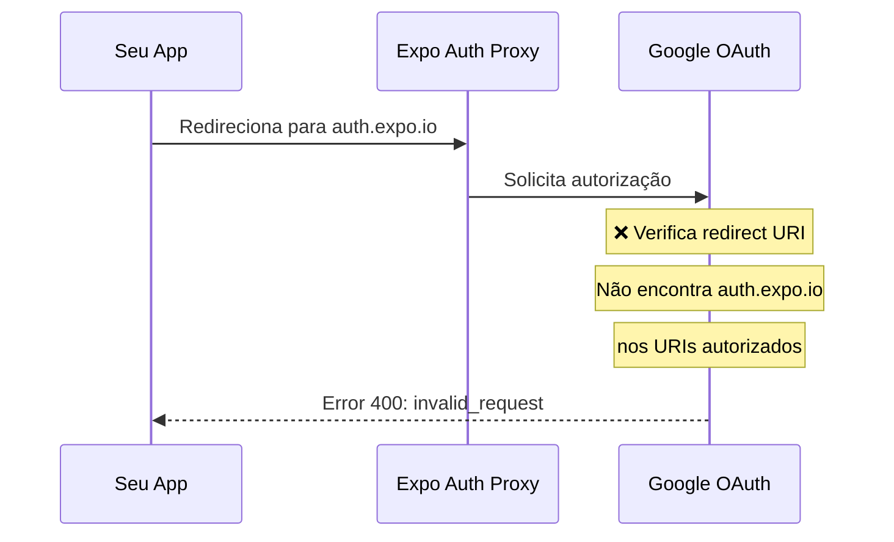

# 🔴 ERRO CONFIRMADO: Web Client ID sem Redirect URI Configurado

## 🎯 Seu Problema Específico

Você está usando:
- **Client ID:** `407408718192.apps.googleusercontent.com` (Web)
- **App:** Expo Go rodando em `192.168.10.5:8081`
- **Erro:** `Error 400: invalid_request`

**Causa:** O Web Client ID não tem o redirect URI do Expo autorizado.

---

## ✅ SOLUÇÃO DEFINITIVA (5 minutos)

### **Passo 1: Adicionar Redirect URIs no Google Console**

1. **Acesse:** https://console.cloud.google.com/apis/credentials

2. **Clique** no seu OAuth Client ID: `407408718192...`

3. Em **"Authorized redirect URIs"**, **ADICIONE TODOS** esses URIs:

```
https://auth.expo.io/@anonymous/shopping-list
https://auth.expo.io/@your-expo-username/shopping-list
shoppinglist://
exp://localhost:8081
exp://192.168.10.5:8081
http://localhost:8081
```

4. **SAVE** e aguarde **2-3 minutos**

### **Passo 2: Reiniciar o App**

```bash
# Pare o Metro (Ctrl+C) e reinicie
cd /home/julio/Documents/GitHub/shopping-list/frontend
npm start --clear
```

### **Passo 3: Testar**

1. Abra o app no Expo Go
2. Clique em "Entrar com Google"
3. Deve funcionar agora! ✅

---

## 🔧 Se Ainda Não Funcionar

### **Alternativa 1: Criar Android Client ID**

Este é o método **correto** para produção:

1. **Google Console** > **CREATE CREDENTIALS** > **OAuth 2.0 Client ID**
2. Tipo: **Android**
3. Configure:
   ```
   Application type: Android
   Package name: host.exp.exponent
   SHA-1 certificate fingerprint: (deixe em branco por enquanto)
   ```
4. **CREATE**
5. Copie o novo Client ID
6. Atualize seu `.env`:
   ```bash
   GOOGLE_CLIENT_ID=<NOVO_ANDROID_CLIENT_ID>.apps.googleusercontent.com
   ```

### **Alternativa 2: Testar no Navegador (Web)**

Se quiser testar rapidamente sem configurar mobile:

```bash
npm run web
```

No Google Console, adicione:
```
http://localhost:8081
http://localhost:19006
```

---

## 📊 Resumo do que está acontecendo



**Solução:** Adicionar `https://auth.expo.io/@anonymous/shopping-list` no Google Console!

---

## 🎯 Redirect URIs Necessários

Para **Expo Go (desenvolvimento)**:
```
https://auth.expo.io/@anonymous/shopping-list
```

Para **Standalone/EAS Build**:
```
shoppinglist://
```

Para **Web**:
```
http://localhost:8081
http://localhost:19006
```

---

## ⚡ AÇÃO IMEDIATA

Execute isso agora:

```bash
# 1. Parar o Metro
Ctrl+C

# 2. Adicionar os redirect URIs no Google Console
# (link acima)

# 3. Aguardar 2-3 minutos

# 4. Reiniciar
npm start --clear
```

---

## 📸 Screenshots para Ajudar

No Google Console, você deve ver algo assim:

```
Authorized redirect URIs
┌────────────────────────────────────────────────────┐
│ https://auth.expo.io/@anonymous/shopping-list      │
│ [Adicionar]                                        │
└────────────────────────────────────────────────────┘
```

Clique em **[Adicionar]** e cole todos os URIs listados acima.

---

## 🆘 Se Precisar de Ajuda

Me mostre o resultado de executar:

```bash
cd /home/julio/Documents/GitHub/shopping-list/frontend
npx expo config --type public | grep -E "slug|scheme|owner"
```

Com isso posso te dar o redirect URI **exato** para configurar!

